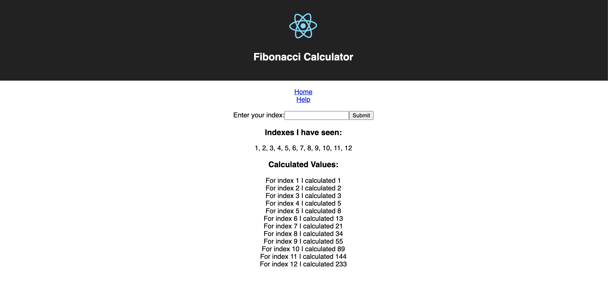

# fibonacci-calculator

## Getting Started

To run the entire stack locally:

`$ docker-compose up`

and visit `localhost:3000` in your browser of choice!

## Overview

1. React.js App

A user will interact with the web app, for example
a user submits a number to be processed, and then
the React app will communicate with the Node.js
(Express) server.

2. Node.js Server

This "Backend" Server performs a number of operations,
primarily functioning as an API for the two databases.

3. Redis Database

The Redis DB is an in-memory store, which is primarily
storing all indicies and calculated values, and returning those
values as key-value pairs to the Express server
(and ultimately back to the React app for the user to see)

4. PostgreSQL Database

This DB stores a perminate list of indicies that has been recieved.

5. Worker Node

This worker node watches the Redis DB instance for any new indicies.
Whenever it sees a new indice, it will pull the indice, calculate the new
value, and then return that value to Redis.
